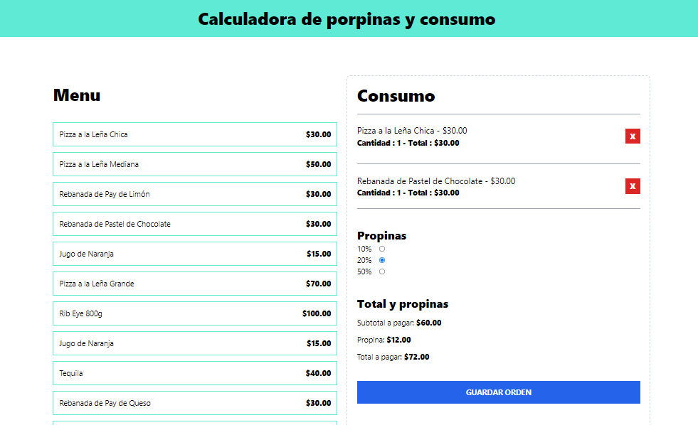

Y en el contexto de tu README, quedaría así:

---

# Tip Percentage Calculator App



This app allows users to calculate the total price of products including different tip percentages. 

## Features

- **Product Price Calculation:** Enter the price of products and get the total amount including the tip.
- **Tip Percentage Options:** Choose from various tip percentages to see how they affect the total price.
- **Component-Based Design:** The app displays content across different components for a modular and maintainable structure.

## Technologies Used

- **React:** For building the user interface.
- **TypeScript:** To add static type checking.
- **Tailwind CSS:** For styling the application.
- **useReducer:** To manage the application's state, replacing a previous custom hook.

## Learning Outcomes

Through developing this app, I:

- Learned to manage state using `useReducer` instead of a custom hook.
- Gained experience in displaying content across different React components.
- Improved my skills in TypeScript and Tailwind CSS.

## Installation

1. Clone the repository:

    ```bash
    git clone https://github.com/AriadnaMorenoL/tip-percentage-calculator-ts.git
    ```

2. Navigate to the project directory:

    ```bash
    cd tip-percentage-calculator
    ```

3. Install the dependencies:

    ```bash
    npm install
    ```

4. Start the development server:

    ```bash
    npm start
    ```
## Production 

Check out the live vesion of the app [here](https://tip-porcentage-calculator-ariadnaml.netlify.app/) .

## Usage

1. Enter the price of the product(s).
2. Select the desired tip percentage.
3. View the total amount including the tip.


## Credits

I would like to give special thanks to the course React y TypeScript - La Guía Completa Creando +10 Proyectos
 by JuanAPblo de la Torre Valdez, where I learned the concepts and techniques used in this app.


